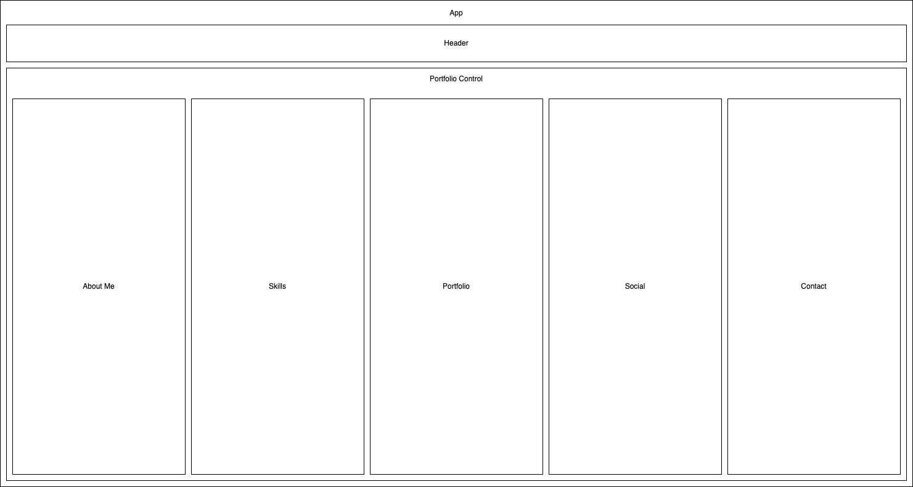

# READ ME

#### By _**(Ben Goodrow)**_

## Technologies Used

* React
* Babel
* Bootstrap
* CSS
* Firebase
* JavaScript
* Jest
* jQuery
* NPM

## Description
_{A Portfolio Website built using React, Javascript, Css, Html, Firebase.}_

## Component Diagram

## Hour Log

### 9/16/2022

- 8:00: Initial commit and react-create-app project set up
- 9:00: Create component diagram
- 10:00 Begin Static Version of App with no styling
- 11:00 Begin working though first few lessons of weekend work to learn about how to correctly use hooks instead of class components
- 1:00: Continue learning about hooks and implementation
- 2:00: Continue React Research
- 3:00: Practice with using hooks by refactoring help-queue project
- 4:00: Return to building static version of app

### 9/23/2022

- 8:00 Begin working on routing to each component
- 9:00 Bug hunting routing issues
- 10:00 still working on nested routes
- 11:00 still can't get nested routes to work moving to styling until lunch
- 1:00 Return to debugging routing
- 2:00 Fine tune routing to show homepage on start up as well as when home is clicked